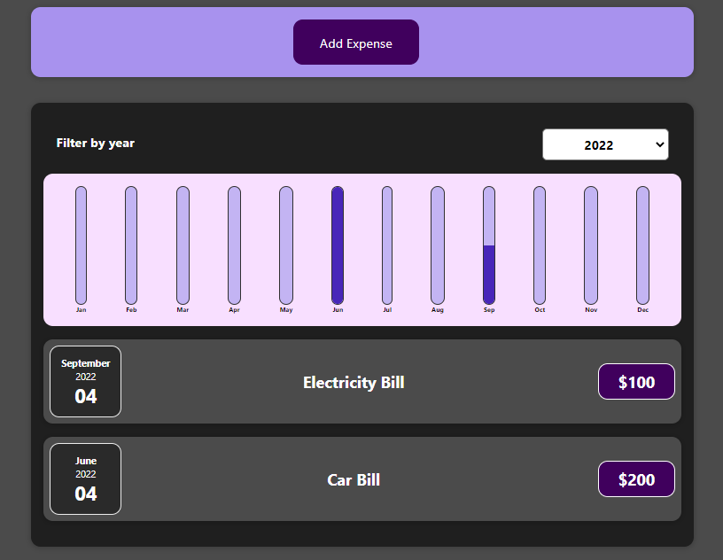

# Expense Tracker App With React And Firebase Database

Here you can add your daily or monthly expenses. There are stored in Firebase

## Link
`https://soft-frangipane-e7ecd3.netlify.app/`

## Preview

## Installation

1. Clone the repo and `cd` into it
2. Run `npm install` to install all required dependencies (this will create a /node_modules folder)
3. You can replace my Firebase database link with your own.
4. Then Run `npm start` to serve your project to localhost:3000
5. Enjoy
